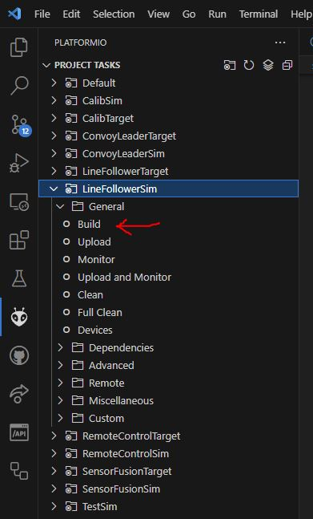
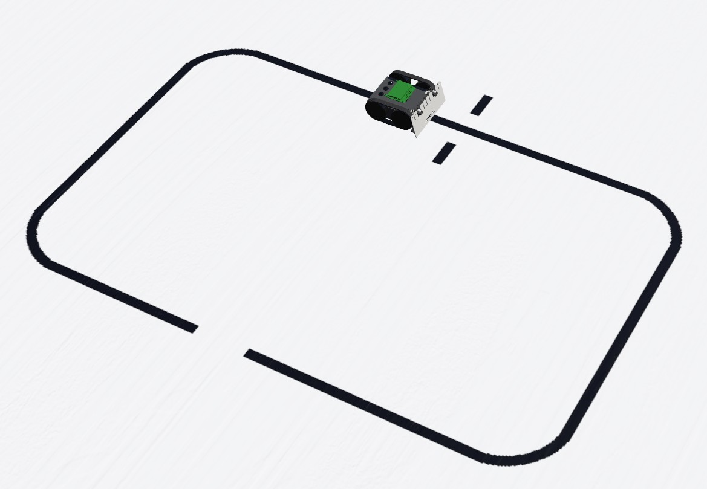
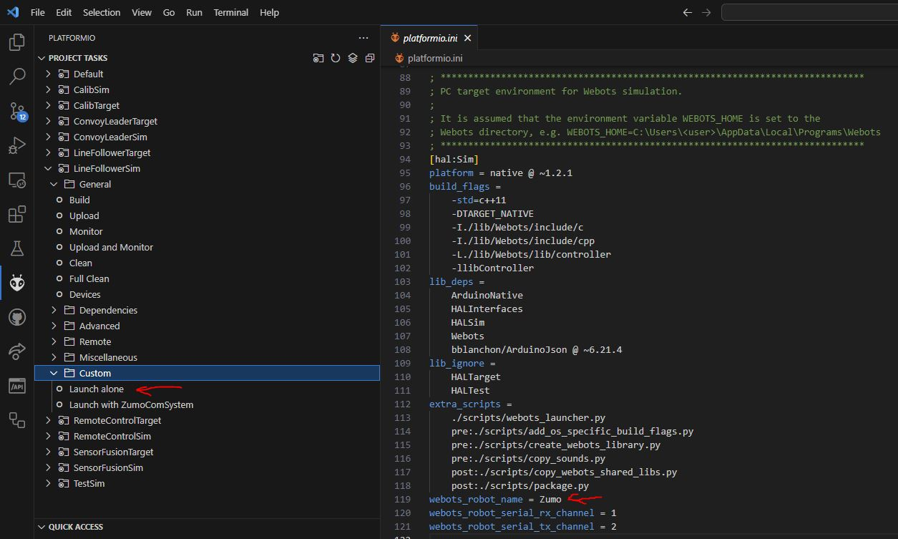
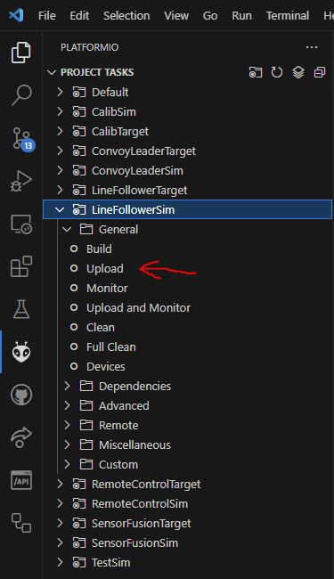
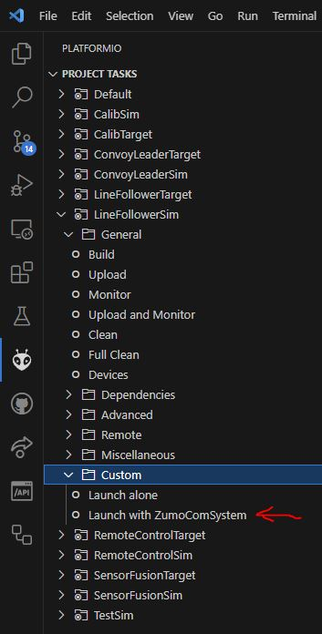
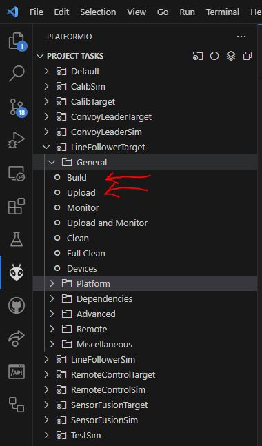

# Radon Ulzer - Firmware for Zumo32U4 <!-- omit in toc -->

[](http://choosealicense.com/licenses/mit/)
[](https://www.repostatus.org/#wip)
[](https://github.com/BlueAndi/RadonUlzer/releases)
[](https://github.com/BlueAndi/RadonUlzer/actions/workflows/main.yml)

A robot as fast as the famous pod racer driven by Anakin Skywalker with the powerful engines from Radon Ulzer. :-)

Several kind of exclusive applications are available:

- Calib - Application used for motor speed calibration.
- Convoy Leader - A line follower, providing information to the [DroidControlShip](https://github.com/BlueAndi/DroidControlShip) in a convoy leader role.
- Line Follower - A line follower, using a PID controller with extended algorithm.
- Line Follower Simple - A simple line follower, using a PID controller.
- Remote Control - The robot is remote controlled by e.g. the [DroidControlShip](https://github.com/BlueAndi/DroidControlShip) in a convoy follower role.
- Sensor Fusion - The robot provides odometry and inertial data to the [DroidControlShip](https://github.com/BlueAndi/DroidControlShip), which calculates the sensor fusion based location information.

## Table of content <!-- omit in toc -->

- [The robot](#the-robot)
- [The simulation](#the-simulation)
  - [Installation](#installation)
  - [The Webots library](#the-webots-library)
  - [Build](#build)
  - [Preparation](#preparation)
  - [Run](#run)
    - [Run with Webots launcher (recommended)](#run-with-webots-launcher-recommended)
    - [Run without Webots launcher](#run-without-webots-launcher)
    - [Run via terminal](#run-via-terminal)
  - [Running the robot on track](#running-the-robot-on-track)
  - [Communicate with the DroidControlShip](#communicate-with-the-droidcontrolship)
  - [Simulation Performance Issue](#simulation-performance-issue)
- [The target](#the-target)
  - [Build and flash procedure](#build-and-flash-procedure)
- [User Specific Configuration](#user-specific-configuration)
- [The Applications](#the-applications)
- [Documentation](#documentation)
- [Used Libraries](#used-libraries)
- [Issues, Ideas And Bugs](#issues-ideas-and-bugs)
- [License](#license)
- [Contribution](#contribution)

## The robot

The main target of the firmware is the Pololu Zumo32U4 robot (see <https://www.pololu.com/category/129/zumo-robots-and-accessories>) from Pololu.


## The simulation

The simulation is based on the open source robot simulator *Webots*. The application and the services are equal to the target firmware. Only the HAL is different in the simulation.

- Website: <https://cyberbotics.com/#cyberbotics>
- Github: <https://github.com/cyberbotics/webots>
- Compatible webots versions:
  - v2025a

### Installation

1. Install [Webots](https://cyberbotics.com).
2. Setup for [external controllers](https://www.cyberbotics.com/doc/guide/running-extern-robot-controllers):
    1. Set environment variable ```WEBOTS_HOME``` to installation directory of Webots.
    2. Add to path:
        - Linux: ```${WEBOTS_HOME}/lib/controller```
        - Windows: ```%WEBOTS_HOME%\lib\controller```
3. Install the native compiler toolchain:
    - Linux: Install the gcc toolchain, depended on your distribution.
    - Windows
        - Install the [MSYS2](https://www.msys2.org) toolchain.
        - Open MSYS2 shell.
            - Update package database: ```pacman -Sy pacman```
            - Install GCC: ```pacman -Sy mingw-w64-ucrt-x86_64-gcc```
4. Ensure a current (>=3.9) Python3 version is installed on your machine and on path.

### The Webots library

To adapt the HAL to the simulation, some sourcecode files from Webots are necessary. Currently there is no Webots library in the platformio registry available. Therefore a local library is created during the build. Ensure that that Webots is already installed, before you try to build it!

The library creation is handled in the ```./scripts/create_webots_library.py``` script and runs automatically after building for the WebotsSim environment.

### Build

1. Start VSCode.
2. PlatformIO project tasks --> &lt;APP-NAME&gt; --> General --> Build\
    Example for **LineFollowerSim** application:\
  

For the simulation use only the applications with "Sim" as postfix, e.g. LineFollowerSim.

### Preparation

The preparation is shown with the line follower application as example. It expects that the **LineFollowerSim** is already built.

1. Start the Webots simulation.
2. File --> Open World
3. Select ```./webots/worlds/LineFollowerTrack.wbt```.
4. The loaded world should now look like this: 
5. The simulation waits now for the external controller, like the RadonUlzer.

### Run

There are 3 ways how to run now the application. Choose according to your needs.

#### Run with Webots launcher (recommended)

Choose this one in case the simulation waits for more than one robot. Adapt the robot name in the *platformio.ini*.

See (Single Simulation and Multiple Local Extern Robot Controllers)[https://cyberbotics.com/doc/guide/running-extern-robot-controllers?tab-os=windows#single-simulation-and-multiple-local-extern-robot-controllers] for details.

PlatformIO project tasks --> &lt;APP-NAME&gt; --> Custom --> WebotsLauncher

Example for **LineFollowerSim** application:



#### Run without Webots launcher

This can be choosen in case the simulation waits just for one robot.

PlatformIO project tasks --> &lt;APP-NAME&gt; --> General --> Upload

Example for **LineFollowerSim** application:



#### Run via terminal

1. Open a command line (shell) and change to the folder with the built executable in ```.pio/build/LineFollowerSim```. This folder contains all necessary shared libraries as well.
2. Start the executable.

### Running the robot on track

1. Click in the simulation on the display to focus the simulation.
2. Now the keyboard keys a, b and c can be used to control the robot according to the implemented application logic.

### Communicate with the DroidControlShip

The communication with the DroidControlShip goes via a Webots serial connection, which is disabled by default.

Use the -c flag to enable it with default channels (see *webots_robot_serial_rx_channel* and *webots_robot_serial_tx_channel* in [platformio.ini](./platformio.ini)). Note, this will disable the standard logging, because the serial communication uses the SerialMuxProt procotol for data interchange.

```bash
program.exe -c
```

For simplicity a Platformio project task was added, which enables the Webots serial connection as well.



### Simulation Performance Issue

By default the Zumo robot in Webots looks beautiful, but has the drawback that the simulation performance might be bad depended on the host system.

To increase the performance, the robot model can be simplified by enabling the performance mode:

1. Open Webots and load the world with the robot.
2. Open the Zumo32U4 model in the tree on the left side.
3. Set performanceMode to TRUE with the checkbox.

## The target

### Build and flash procedure

1. PlatformIO project tasks --> &lt;APP-NAME&gt; --> General --> Build
    - For the target use only the applications with "Target" as postfix, e.g. LineFollowerTarget.
2. Start the bootloader by triggering twice the reset button. The yellow led will start blinking for 10s. Note, after 10s the target will leave the bootloader!
3. PlatformIO project tasks --> &lt;APP-NAME&gt; --> General --> Upload
4. Ready.

Example for the **LineFollowerTarget** application:



## User Specific Configuration

Change your com port settings in the *platformio_override.ini* to your needs, as well as for simulation the robot name and the serial rx/tx channels.

## The Applications

| Application | Description | Standalone | DroidControlShop Required | Webots World |
| - | - | - | - | - |
| Calib | Application used for motor speed calibration. | Yes | No | ./webots/worlds/LargeTrack.wbt  ./webots/worlds/LineFollowerTrack.wbt |
| ConvoyLeader | A line follower, providing information to the [DroidControlShip](https://github.com/BlueAndi/DroidControlShip) in a convoy leader role. | No | Yes | ./webots/worlds/zumo_with_com_system/PlatoonTrack.wbt |
| ConvoyFollower | Convoy follower, providing information to the [DroidControlShip](https://github.com/BlueAndi/DroidControlShip) to drive to its target. | No | Yes | ./webots/worlds/zumo_with_com_system/PlatoonTrack.wbt |
| LineFollower | Just a line follower, using a PID controller with differential drive and odometry. | Yes | No | ./webots/worlds/ETrack.wbt  ./webots/worlds/LargeTrack.wbt  ./webots/worlds/LineFollowerTrack.wbt |
| LineFollowerSimple | Just a simple line follower, using a PID controller. | Yes | No | ./webots/worlds/ETrack.wbt  ./webots/worlds/LargeTrack.wbt  ./webots/worlds/LineFollowerTrack.wbt |
| RemoteControl | The robot is remote controlled by e.g. the [DroidControlShip](https://github.com/BlueAndi/DroidControlShip) in a convoy follower role. | No | Yes | ./webots/world/zumo_with_com_system/* |
| SensorFusion | The robot provides odometry and inertial data to the [DroidControlShip](https://github.com/BlueAndi/DroidControlShip), which calculates the sensor fusion based location information. | No | Yes | ./webots/worlds/zumo_with_com_system/LineFollowerTrack.wbt |
| Test | Only for testing purposes on native environment. | Yes | No | N/A |

## Documentation

- [SW Architecture](./doc/architecture/README.md)
- [SW Configuration](./doc/configuration/README.md)

## Used Libraries

| Library                                                            | Description                                          | License |
| ------------------------------------------------------------------ | ---------------------------------------------------- | ------- |
| [ArduinoNative](https://github.com/BlueAndi/ArduinoNative)         | The Arduino for native environment.                  | MIT     |
| [SerialMuxProt](https://github.com/gabryelreyes/SerialMuxProt)     | Multiplexing Communication Protocol                  | MIT     |
| [ZumoHALATmega32u4](https://github.com/BlueAndi/ZumoHALATmega32u4) | C++ HAL for ATmega32u4 on the Pololu Zumo32u4        | MIT     |
| [ZumoHALInterfaces](https://github.com/BlueAndi/ZumoHALInterfaces) | Abstract C++ HAL interfaces                          | MIT     |
| [ZumoHALWebots](https://github.com/BlueAndi/ZumoHALWebots)         | C++ HAL for Webots simulation of the Pololu Zumo32u4 | MIT     |

## Issues, Ideas And Bugs

If you have further ideas or you found some bugs, great! Create a [issue](https://github.com/BlueAndi/RadonUlzer/issues) or if you are able and willing to fix it by yourself, clone the repository and create a pull request.

## License

The whole source code is published under the [MIT license](http://choosealicense.com/licenses/mit/).
Consider the different licenses of the used third party libraries too!

## Contribution

Unless you explicitly state otherwise, any contribution intentionally submitted for inclusion in the work by you, shall be licensed as above, without any
additional terms or conditions.
